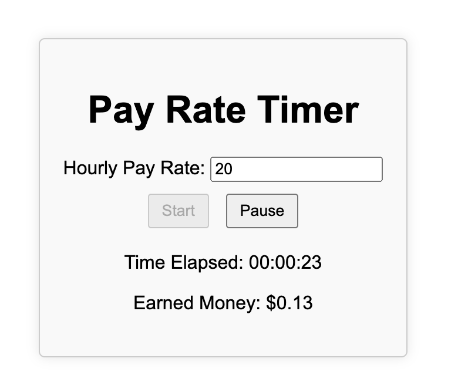

# moneymade
# A Pay Rate Timer Web App

This is a simple client-side web app that allows users to track how much time has elapsed and how much money they have earned based on their hourly pay rate. The app features a start button and a pause button to control the timer.



## Features

- Enter your hourly pay rate.
- Start and pause the timer.
- See the elapsed time and earned money.

## Getting Started

1. Clone this repository to your local machine:

   ```bash
   git clone https://github.com/mreedthing/moneymade.git

## Usage

- Open the web app in your browser.
- Enter your hourly pay rate in the provided input field.
- Click the "Start" button to begin the timer. The timer will track the elapsed time and update the earned money based on your pay rate.
- Click the "Pause" button to pause the timer. You can resume it by clicking the "Start" button again.

## Technologies Used

- HTML
- CSS
- JavaScript

## License
This project is licensed under the MIT License.
